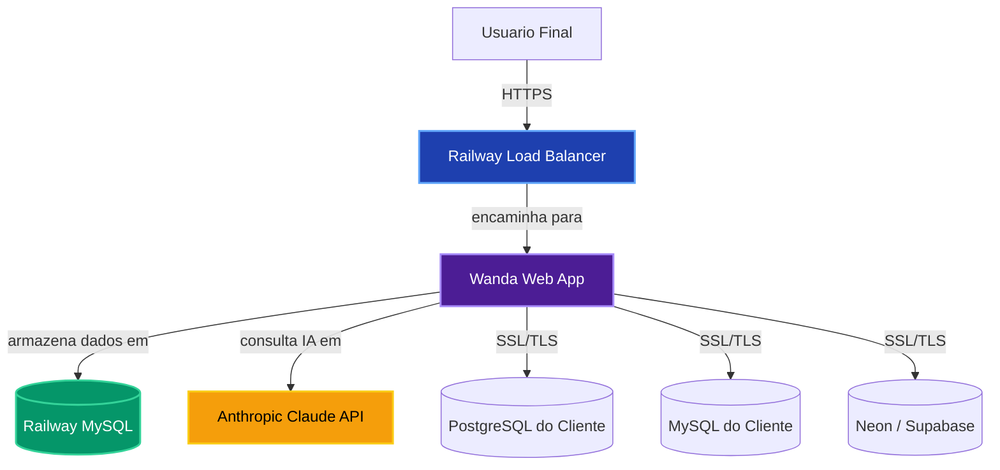
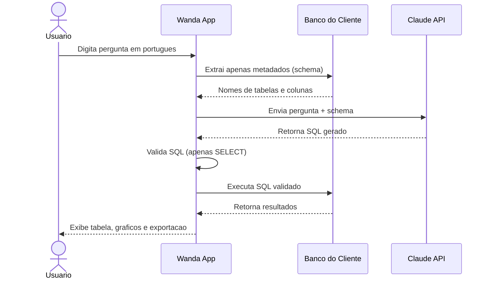

# Arquitetura da Plataforma Wanda

**Versão:** 1.0
**Data:** 06 de Março de 2026

Este documento descreve a arquitetura técnica da plataforma Wanda, detalhando seus componentes, fluxo de dados e tecnologias utilizadas.

---

## 1. Diagrama de Arquitetura Geral (SaaS)

A versão SaaS da Wanda, hospedada no Railway, segue uma arquitetura desacoplada otimizada para escalabilidade e resiliência.



| Componente | Tecnologia | Descrição |
| :--- | :--- | :--- |
| **Wanda Web App** | Python Flask + Gunicorn | Aplicação principal: interface web, lógica de negócio e orquestração de serviços. |
| **Railway MySQL** | MySQL gerenciado | Banco de dados da aplicação Wanda (usuários, conexões, histórico de consultas). |
| **Anthropic Claude API** | API REST | Serviço de IA que recebe a pergunta e o schema do banco, e retorna a consulta SQL. |
| **Bancos do Cliente** | PostgreSQL, MySQL, etc. | Bancos externos do cliente, acessados em modo somente leitura pela Wanda. |

---

## 2. Fluxo de Dados de uma Consulta NL2SQL

O fluxo de uma consulta em linguagem natural envolve múltiplos componentes trabalhando em sequência para garantir segurança e precisão.



O fluxo segue 8 etapas sequenciais:

1. **Pergunta do usuário** — O usuário digita em português natural (ex: "Quais os 5 clientes com maior faturamento?").
2. **Extração de schema** — A Wanda conecta ao banco do cliente e extrai apenas metadados (nomes de tabelas e colunas). **Nenhum dado de negócio é lido ou armazenado.**
3. **Chamada para a IA** — A pergunta e o schema são enviados para a API do Claude.
4. **Geração do SQL** — O Claude retorna uma consulta SQL otimizada para responder à pergunta.
5. **Validação de segurança** — A Wanda analisa o SQL para garantir que contém apenas comandos de leitura (`SELECT`). Comandos `DROP`, `DELETE`, `UPDATE` e `INSERT` são bloqueados.
6. **Execução da consulta** — O SQL validado é executado no banco do cliente.
7. **Retorno dos dados** — Os resultados são retornados para a aplicação Wanda.
8. **Visualização** — Os dados são exibidos em tabela, com opção de gráficos e exportação para CSV/PDF.

---

## 3. Estrutura do Repositório de Código

O projeto é organizado de forma modular para facilitar manutenção e desenvolvimento.

```
/wanda
├── .env.example              # Exemplo de variáveis de ambiente
├── .gitignore                # Arquivos ignorados pelo Git
├── docker-compose.yml        # Orquestração de contêineres (local/on-premise)
├── Dockerfile                # Definição do contêiner da aplicação
├── Procfile                  # Deploy em Railway/Heroku
├── README.md                 # Documentação principal
├── ARQUITETURA_WANDA.md      # Este documento
├── WANDA_ON_PREMISE_GUIDE.md # Guia de instalação corporativa
├── GUIA_IMPLANTACAO.md       # Guia de implantação para leigos
├── PLANO_DE_NEGOCIOS_WANDA.md# Plano de negócios
├── render.yaml               # Configuração para o Render.com
├── requirements.txt          # Dependências Python
├── start.sh                  # Script de inicialização Docker
├── wsgi.py                   # Ponto de entrada WSGI
└── src/
    ├── extensions.py         # Extensões Flask (db, login_manager)
    ├── main.py               # Ponto de entrada principal Flask
    ├── models/               # Modelos de banco de dados (SQLAlchemy)
    │   ├── connection.py     # Modelo: conexões de banco de dados
    │   ├── query.py          # Modelo: consultas salvas
    │   └── user.py           # Modelo: usuário
    ├── routes/               # Endpoints da aplicação
    │   ├── auth.py           # Autenticação (login, registro)
    │   ├── connections.py    # Gerenciamento de conexões
    │   ├── dashboard.py      # Dashboard principal
    │   ├── landing.py        # Landing page institucional
    │   └── query.py          # API de consultas NL2SQL
    ├── services/             # Lógica de negócio e integrações externas
    │   ├── db_connector.py   # Conexão e execução de queries em bancos externos
    │   ├── export.py         # Exportação para CSV e PDF
    │   └── nl2sql.py         # Integração com a API do Claude
    ├── static/               # Arquivos estáticos (CSS, JS, imagens)
    │   └── img/
    │       └── wanda_hero.png
    └── templates/            # Templates HTML (Jinja2)
        ├── auth/             # Login e registro
        ├── dashboard/        # Interface de consultas e dashboard
        ├── landing/          # Landing page institucional
        └── base.html         # Template base
```

---

## 4. Tecnologias Utilizadas

| Camada | Tecnologia | Versão | Finalidade |
| :--- | :--- | :--- | :--- |
| **Backend** | Python | 3.11+ | Linguagem principal |
| **Framework Web** | Flask | 3.x | Servidor web e roteamento |
| **Servidor WSGI** | Gunicorn | 21.x | Servidor de produção |
| **ORM** | SQLAlchemy | 2.x | Abstração do banco de dados |
| **Autenticação** | Flask-Login + Bcrypt | — | Sessões e hash de senhas |
| **IA NL2SQL** | Anthropic Claude | claude-sonnet-4 | Conversão linguagem natural → SQL |
| **Banco da App** | MySQL (Railway) | 8.x | Dados da aplicação Wanda |
| **Bancos Suportados** | PostgreSQL, MySQL, SQLite, SQL Server | — | Bancos dos clientes |
| **Frontend** | HTML + Tailwind CSS | CDN | Interface do usuário |
| **Gráficos** | Chart.js | CDN | Visualização de dados |
| **Deploy** | Railway | — | Hospedagem em nuvem |
| **Contêineres** | Docker + Docker Compose | 24.x | On-premise e desenvolvimento local |
