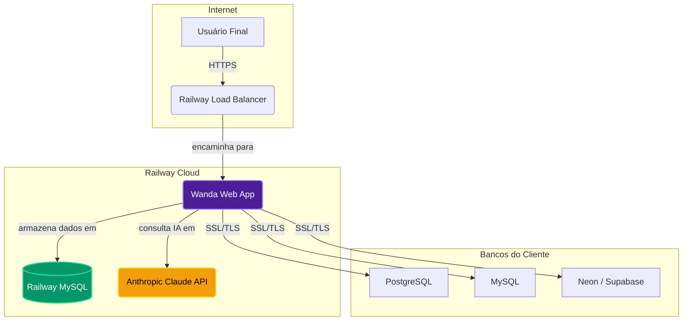

# Arquitetura da Plataforma Wanda

**Versão:** 1.0
**Data:** 06 de Março de 2026

Este documento descreve a arquitetura técnica da plataforma Wanda, detalhando seus componentes, fluxo de dados e tecnologias utilizadas.

---

## 1. Diagrama de Arquitetura Geral (SaaS)

A versão SaaS da Wanda, hospedada no Railway, segue uma arquitetura de microsserviços desacoplada, otimizada para escalabilidade e resiliência.



| Componente | Tecnologia | Descrição |
| :--- | :--- | :--- |
| **Wanda Web App** | Python (Flask), Gunicorn | Aplicação principal que serve a interface do usuário, gerencia a lógica de negócio e orquestra as chamadas para outros serviços. |
| **Railway MySQL** | MySQL | Banco de dados gerenciado que armazena os dados da aplicação Wanda (usuários, conexões, histórico de consultas). |
| **Anthropic Claude API** | API REST | Serviço de IA externo que recebe a pergunta do usuário e o schema do banco, e retorna a consulta SQL correspondente. |
| **Bancos do Cliente** | PostgreSQL, MySQL, etc. | Bancos de dados externos pertencentes ao cliente, dos quais os dados são extraídos. A Wanda se conecta a eles em modo de apenas leitura. |

## 2. Fluxo de Dados de uma Consulta NL2SQL

O fluxo de uma consulta em linguagem natural é o coração da plataforma. Ele envolve múltiplos componentes trabalhando em sequência para garantir segurança e precisão.

1.  **Usuário faz a pergunta:** O usuário digita uma pergunta (ex: "Quais os 5 clientes com maior faturamento?") na interface web.
2.  **Extração de Schema:** A aplicação Wanda se conecta ao banco de dados do cliente (com as credenciais criptografadas) e extrai apenas os metadados (nomes de tabelas e colunas). **Nenhum dado de negócio é lido ou armazenado.**
3.  **Chamada para a IA:** A aplicação envia a pergunta do usuário e o schema do banco para a API do Claude (Anthropic).
4.  **Geração do SQL:** O Claude analisa a pergunta e o schema, e retorna uma consulta SQL otimizada para responder à pergunta.
5.  **Validação de Segurança:** A aplicação Wanda analisa o SQL recebido para garantir que ele contém apenas comandos de leitura (`SELECT`). Comandos `DROP`, `DELETE`, `UPDATE`, `INSERT` são bloqueados.
6.  **Execução da Consulta:** O SQL validado é executado no banco de dados do cliente.
7.  **Retorno dos Dados:** Os resultados da consulta são retornados para a aplicação Wanda.
8.  **Visualização:** A aplicação exibe os dados em uma tabela na interface do usuário e permite a criação de gráficos e a exportação para CSV/PDF.

## 3. Estrutura do Repositório de Código

O projeto é organizado de forma modular para facilitar a manutenção e o desenvolvimento.

```
/wanda
├── .env.example           # Exemplo de arquivo de variáveis de ambiente
├── .gitignore             # Arquivos ignorados pelo Git
├── docker-compose.yml     # Orquestração de contêineres para ambiente local/on-premise
├── Dockerfile             # Definição do contêiner da aplicação Wanda
├── Procfile               # Para deploy em plataformas como Heroku/Railway (legado)
├── README.md              # Documentação principal do projeto
├── render.yaml            # Configuração de deploy para o Render.com
├── requirements.txt       # Dependências Python do projeto
├── start.sh               # Script de inicialização para o Docker
├── wsgi.py                # Ponto de entrada WSGI
└── src/
    ├── __init__.py
    ├── extensions.py        # Inicialização de extensões Flask (db, login_manager)
    ├── main.py              # Ponto de entrada principal da aplicação Flask
    ├── models/              # Modelos de banco de dados (SQLAlchemy)
    │   ├── __init__.py
    │   ├── connection.py    # Modelo para conexões de banco de dados
    │   ├── query.py         # Modelo para consultas salvas
    │   └── user.py          # Modelo de usuário
    ├── routes/              # Definição das rotas/endpoints da aplicação
    │   ├── __init__.py
    │   ├── auth.py          # Rotas de autenticação (login, registro)
    │   ├── connections.py   # Rotas para gerenciar conexões
    │   ├── dashboard.py     # Rotas do dashboard principal
    │   ├── landing.py       # Rota da landing page
    │   └── query.py         # API para processar consultas NL2SQL
    ├── services/            # Lógica de negócio e integração com serviços externos
    │   ├── __init__.py
    │   ├── db_connector.py  # Lógica para conectar e executar queries em bancos externos
    │   ├── export.py        # Lógica para exportar dados para CSV e PDF
    │   └── nl2sql.py        # Lógica para interagir com a API do Claude
    ├── static/              # Arquivos estáticos (CSS, JS, imagens)
    │   └── img/
    │       └── wanda_hero.png
    └── templates/           # Templates HTML (Jinja2)
        ├── auth/
        ├── base.html
        ├── dashboard/
        └── landing/
```
